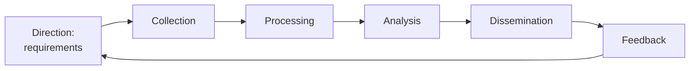
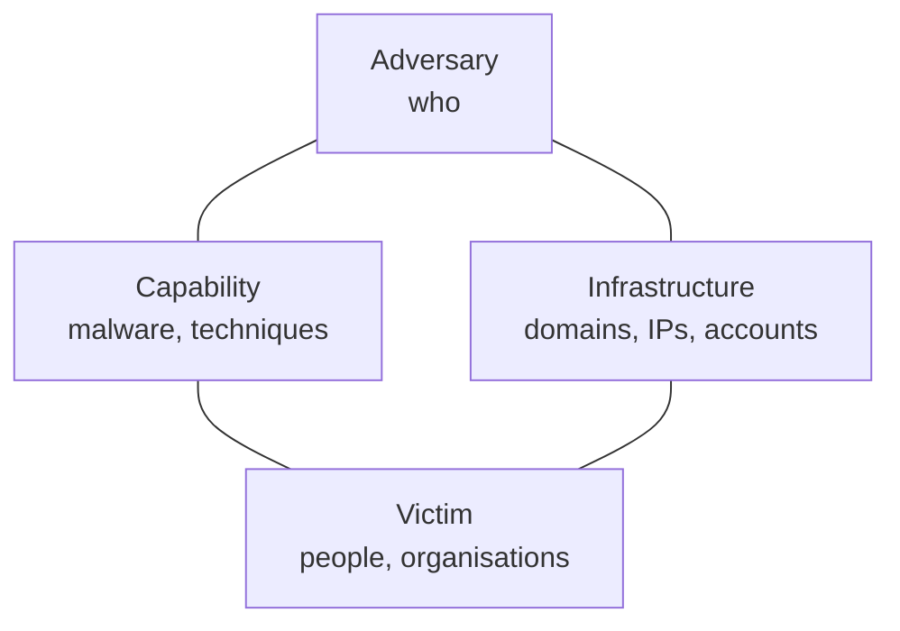

# Module 01 - CTI Foundations and the Air Force Threat Landscape

## 1. Why Threat Intelligence Matters to an Air Force

Between mid-2016 and early 2017, a group researchers later named APT33 compromised a US aerospace organisation and targeted a Saudi conglomerate with aviation holdings. Its emails offered jobs, with real salaries, real job descriptions and links to real employment sites. It registered web domains that imitated Boeing, Alsalam Aircraft Company and Northrop Grumman Aviation Arabia. Once a target opened the lure, a custom backdoor installed itself silently ([Dark Reading](https://www.darkreading.com/cyberattacks-data-breaches/iranian-cyberspy-group-targets-aerospace-energy-firms)).

The analysts who uncovered this did not stop at "we found malware". They judged *why*: the pattern of targets suggested the group was seeking insight into Saudi military aviation capabilities ([Google Cloud / FireEye](https://cloud.google.com/blog/topics/threat-intelligence/apt33-insights-into-iranian-cyber-espionage)). That step, from technical facts to a judgement a decision-maker can act on, is what threat intelligence is.

Air forces are high-value targets. Their people can be recruited, impersonated and tracked. Their suppliers write the code they run. Their aircraft broadcast positions, and their bases show up in satellite images and in the fitness apps of the people who work there. Cyber threat intelligence (CTI) is how you find out who is exploiting that, and what to do about it before it becomes an incident.

### What you will learn in this module

By the end of this module you will be able to:

- Turn a commander's question into intelligence requirements that tell collectors exactly what to look for.
- Grade every source and piece of information with the Admiralty system.
- State how sure you are using the intelligence community's standard vocabulary.
- Organise what you know about a threat with the Diamond Model and MITRE ATT&CK, and query ATT&CK's data yourself.
- Read a real threat report and extract what matters for your organisation.
- Mark and share intelligence correctly with the Traffic Light Protocol.

### Module structure

| Section | Type |
| --- | --- |
| 1. Why threat intelligence matters to an air force | Theory |
| 2. The intelligence cycle and requirements | Theory and practice |
| 3. Sources and reliability | Practice |
| 4. Saying how sure you are | Practice |
| 5. Frameworks that organise threats | Practice: ATT&CK data |
| 6. Reading a real threat report | Practice: APT33 |
| 7. Handling and sharing | Theory and practice |
| 8. Skills assessment: the first threat landscape brief | Assessment |

### The course case

For the rest of this course you work in the cyber intelligence cell of a fictional air force. On your first day, the commander asks one question:

> Who is targeting us, how, through what infrastructure, and what are we exposing ourselves?

One answer is already emerging. A threat actor using the persona **nightjar** has been advertising "custom loaders" on an underground forum, and a squadron's personnel have received job offers from a recruiter no one can verify. Every module will uncover another part of this campaign. It is synthetic: built in a lab for this course, so you can investigate people and infrastructure without touching anyone real.

### Setting up

```bash
sudo apt install -y curl jq python3 git
mkdir -p ~/cti/m01/evidence && cd ~/cti/m01
```

Every artifact you collect goes into `evidence/`, gets hashed with `sha256sum`, and gets one line in your evidence log with its source and UTC time. Section 3 adds a reliability grade to each line.

### Rules of engagement

You work only with published reports, public datasets, and the course lab. You never investigate real service members, never interact with attacker infrastructure, and never share anything outside the class without its handling marking (Section 7).

### Questions

Answer the questions below to complete this section.

1. Which three organisations did APT33's look-alike domains imitate?
2. What kind of lure did APT33 use to get targets to open its files?
3. In one sentence, what is the difference between the facts the analysts found and the judgement they made?

## 2. The Intelligence Cycle and Requirements

The most common way CTI fails is not bad analysis. It is answering a question nobody asked. A team spends a week producing a beautiful report on ransomware trends while the commander needed to know whether the recruiter messaging her pilots is hostile. Intelligence starts with the question, and everything else follows from it.

### The cycle



The arrow from feedback back to direction matters most: every product should change what you look for next.

| Phase | Question it answers | In this course |
| --- | --- | --- |
| Direction | What does the decision-maker need to know, and by when? | The commander's question, broken into requirements |
| Collection | Where can that information come from? | Open sources, public datasets, the course lab |
| Processing | How do we make raw data usable? | Saving, hashing, parsing, deduplicating, translating |
| Analysis | What does it mean? | Correlating, testing hypotheses, making judgements |
| Dissemination | Who needs it, in what form? | Reports, briefs, hunting packs, marked with TLP |
| Feedback | Did it help? What should change? | The commander's follow-up questions |

### From a question to requirements

A commander's question is too broad to collect against. You break it down in three levels:

| Level | What it is | Example |
| --- | --- | --- |
| **Priority intelligence requirement (PIR)** | A question the commander needs answered to make a decision | Which threat actors are approaching our personnel with fake job offers, and through which channels? |
| **Essential element of information (EEI)** | A specific fact that helps answer a PIR | Which personas have contacted personnel since 1 January? Which domains do their links use? |
| **Collection task** | Where and how you will look for that fact | Search the forum for the persona's handle; extract domains from the reported emails; check the personas' keys |

A good requirement has four properties. It is **specific**: it names what, who and where. It is **answerable** from sources you can reach. It is **time-bound**: it says by when. And it is **tied to a decision**: someone will act differently depending on the answer.

| Weak requirement | Why it fails | Better |
| --- | --- | --- |
| "Tell us about cyber threats." | No scope, no decision, no deadline | "Which groups targeted aviation or defence organisations in our region in the last 12 months, and with what initial-access techniques? Needed by Friday for the security review." |
| "Is nightjar dangerous?" | "Dangerous" is not observable | "Has nightjar sold tooling to actors who have targeted air forces or their suppliers?" |
| "Monitor Telegram." | A task, not a question | "Are hacktivist channels claiming attacks on our systems, and are any claims supported by evidence?" |

### Who asks, and what they need

Different consumers need different products. Knowing who will read your work decides its depth and format.

| Consumer | Needs | Typical product |
| --- | --- | --- |
| Commander | Decisions: risk, priorities, resources | One-page brief with the bottom line first |
| SOC / CSIRT | Things to detect and block now | Hunting pack: indicators, detection ideas, expiry dates |
| Security and OPSEC officers | What our people and units expose | Exposure report with fixes |
| Procurement and supplier management | Whether suppliers are a risk | Supplier threat assessment |

### Hands-on: write the requirements for the course case

Create a requirements register, one row per requirement:

```bash
cat > requirements.csv <<'EOF'
id,level,parent,text,consumer,deadline,sources,module
PIR-1,PIR,,"Which threat actors are approaching our personnel with fake job offers, and through which channels?",Commander,2026-11-01,,
EEI-1.1,EEI,PIR-1,"Which personas have contacted personnel since 2026-01-01?",CSIRT,2026-10-20,"reported emails; forum; persona keys",M02
EOF
```

The commander's question has four parts: *who* is targeting us, *how*, *through what infrastructure*, and *what are we exposing*. PIR-1 covers the first. Write PIR-2, PIR-3 and PIR-4 for the other three, each with at least two EEIs. For every EEI, name one type of source you would use and the module of this course most likely to answer it (see the course plan).

Keep this file. You will add to it throughout the course, and your final report will answer it line by line.

### Questions

Answer the questions below to complete this section.

1. Put the six phases of the intelligence cycle in order.
2. In which phase is it decided what will be collected?
3. Rewrite this requirement so it meets all four properties: "Find out about GPS problems."
4. Submit your `requirements.csv` with PIR-1 to PIR-4 and at least eight EEIs. *(graded by rubric)*
5. Which consumer should receive a list of malicious domains with expiry dates, and in what product?

## 3. Sources and Reliability

A hacktivist channel posts a screenshot and claims it has breached an air force's personnel system. Within an hour, three news sites repeat the claim, and someone forwards you the articles as "confirmation". Is it true? You don't know yet, and you should be able to say so precisely. The Admiralty system, used by NATO militaries and intelligence services for decades, gives you the words.

### Two separate judgements

The system grades two different things, and keeps them apart.

**Source reliability** asks: how has this source performed in the past?

| Grade | Meaning |
| --- | --- |
| A | Completely reliable |
| B | Usually reliable |
| C | Fairly reliable |
| D | Not usually reliable |
| E | Unreliable |
| F | Reliability cannot be judged |

**Information credibility** asks: how believable is this particular piece of information?

| Grade | Meaning |
| --- | --- |
| 1 | Confirmed by other sources |
| 2 | Probably true |
| 3 | Possibly true |
| 4 | Doubtful |
| 5 | Improbable |
| 6 | Truth cannot be judged |

You write them together: **B2** means a usually reliable source reporting something probably true. They are separate because they fail separately. A reliable vendor can relay a mistaken detail (B4). A source you have never used can report something you can confirm yourself (F1).

### Four traps

**Circular reporting.** Three news articles that all cite one vendor report are one source, not four. Always trace a claim back to its origin before counting it as corroboration.

**Upgrading by repetition.** A claim does not become more credible because more channels repeat it. Only independent confirmation moves information towards 1.

**New does not mean bad.** A source you have never used is **F**, not **E**. Unknown and unreliable are different judgements.

**Actors grade themselves well.** A criminal advertising their tools, or a hacktivist claiming a breach, is a source with a motive to exaggerate. Grade the claim, and look for evidence it cannot fake.

### Machine-readable grades

Threat-intelligence platforms such as MISP store these grades as tags, so they travel with the data. The MISP project publishes its taxonomies openly:

```bash
curl -sS https://raw.githubusercontent.com/MISP/misp-taxonomies/main/admiralty-scale/machinetag.json -o evidence/E-301_admiralty.json
jq -r '.values[] | .predicate as $p | .entry[] | "\($p): \(.value) = \(.expanded)"' evidence/E-301_admiralty.json
```

```text
source-reliability: a = Completely reliable
source-reliability: b = Usually reliable
...
source-reliability: g = Deliberatly deceptive
information-credibility: 1 = Confirmed by other sources
...
```

Notice the last source-reliability value. MISP adds a **G, deliberately deceptive**, which is not part of the traditional scale. Useful for known disinformation outlets, but say that you are using it, because not every reader will know it.

From now on, add an `admiralty` column to your evidence log and grade every row.

### Hands-on: grade the course's first reports

The cell's inbox on day one contains seven items. Grade each one with a letter and a number, and write one sentence of justification.

| # | Item |
| --- | --- |
| 1 | FireEye's 2017 public report on APT33 targeting aviation |
| 2 | A news article summarising that same FireEye report |
| 3 | A post on a hacktivist Telegram channel claiming it breached the air force's HR portal, with one cropped screenshot |
| 4 | Your own SOC's firewall logs showing three workstations contacting a domain from a job-offer email |
| 5 | nightjar's forum post claiming its loader "was used against NATO air bases" |
| 6 | A joint advisory from two national cyber agencies naming a group that targets defence suppliers |
| 7 | An anonymous paste titled "leaked pilot roster", with no source and no date |

A note on item 7: if a real leak ever reaches you, do not open, copy or forward it beyond what your authority allows. Report it and grade it; don't spread it.

### Questions

Answer the questions below to complete this section.

1. Grade items 1 to 7 above, each with a letter, a number and one sentence of justification. *(graded by rubric)*
2. Three news sites and one vendor blog report the same finding, and all three sites link to the blog. How many independent sources do you have?
3. What source-reliability grade do you give a source you have never used before?
4. Which value in MISP's admiralty-scale taxonomy is not part of the traditional scale?
5. Why are source reliability and information credibility graded separately? *(one sentence)*

## 4. Saying How Sure You Are

Ask ten people what "likely" means as a percentage and you will get ten answers. In an experiment with 924 participants, readers matched the intelligence community's intended meaning of words like "very unlikely" only about a third of the time, unless the numbers were printed next to the words ([PLOS ONE via PMC](https://www.ncbi.nlm.nih.gov/pmc/articles/PMC6469752/)). A commander who reads "possibly" as 70% when you meant 30% will make the wrong call. Intelligence writing fixes this with a standard vocabulary.

### Two dials, not one

Every analytic judgement has two separate properties.

- **Likelihood**: how probable is it that the thing is true or will happen?
- **Confidence**: how good is the evidence and reasoning behind that estimate?

They move independently. "Very likely, low confidence" is a real and useful statement: everything you have points one way, but you have very little.

### The likelihood scale

US Intelligence Community Directive 203 (ICD 203) defines seven terms. MISP stores them as a taxonomy, so you can pull them from the same repository as the Admiralty grades:

```bash
curl -sS https://raw.githubusercontent.com/MISP/misp-taxonomies/main/estimative-language/machinetag.json -o evidence/E-401_estimative.json
jq -r '.values[] | select(.predicate=="likelihood-probability") | .entry[].expanded' evidence/E-401_estimative.json
```

| Term | Also written as | Probability |
| --- | --- | --- |
| Almost no chance | Remote | 1–5% |
| Very unlikely | Highly improbable | 5–20% |
| Unlikely | Improbable | 20–45% |
| Roughly even chance | Roughly even odds | 45–55% |
| Likely | Probable | 55–80% |
| Very likely | Highly probable | 80–95% |
| Almost certain | Nearly certain | 95–99% |

No term covers 0% or 100%. Intelligence judgements are never certain; if something is certain, it is a fact and you report it as one.

### Confidence levels

| Level | Typically means |
| --- | --- |
| High | Good-quality sources, independent corroboration, few gaps; the judgement is unlikely to change |
| Moderate | Credible sources and plausible reasoning, but important gaps or limited corroboration |
| Low | Scant, questionable or single-source information; the judgement could easily change |

### Putting it together

A well-formed judgement states the likelihood, the confidence, the main evidence, and what would change it:

> We assess with **moderate confidence** that nightjar is **likely** (55–80%) selling tooling to more than one customer, based on two separate encrypted replies in its forum thread (B2). A single operator using several accounts would also explain this; forum registration data would distinguish the two.

In this course's labels, an **Inference** is always written this way. A **Fact** needs no likelihood word. A **Hypothesis** gets no likelihood yet, only the test you will run.

### Words that hide uncertainty

These phrases sound careful but carry no measurable meaning: *may*, *might*, *could*, *possibly*, *appears to*, *we believe* (with no confidence level), and doubled hedges such as *may possibly*. Replace each one with a term from the scale, or say plainly that the evidence doesn't allow an estimate.

### Hands-on: rewrite a real judgement

FireEye's 2017 APT33 report makes this judgement ([Google Cloud / FireEye](https://cloud.google.com/blog/topics/threat-intelligence/apt33-insights-into-iranian-cyber-espionage)). In summary: because APT33 targeted several companies with aviation partnerships to Saudi Arabia, FireEye judged that the group "may possibly be looking to gain insights" into Saudi military aviation capabilities.

It is a reasonable judgement in weak words. Rewrite it as one ICD 203-style sentence: a likelihood term, a confidence level, the evidence it rests on, and one alternative explanation. You have only the facts in the report's public summary; don't invent new ones.

### Questions

Answer the questions below to complete this section.

1. Which ICD 203 term covers 55–80%?
2. What probability range does "very unlikely" cover?
3. Why does no term cover 100%? *(one sentence)*
4. Rewrite FireEye's judgement as described above. *(graded by rubric)*
5. A judgement rests on a single vendor report you cannot verify, and it points strongly one way. Which likelihood and which confidence might you honestly give it? *(one word each)*
6. Find the two-word hedge in FireEye's judgement that this section tells you to avoid.

## 5. Frameworks That Organise Threats

Raw findings pile up fast: a domain here, a malware name there, a persona, a job lure. Three frameworks turn that pile into something you can reason about and share. You will use all three for the rest of the course.

### The Diamond Model: four things every intrusion has

Every malicious event has an **adversary** who uses a **capability** over some **infrastructure** against a **victim**.



Its real power is the edges: from any one vertex you can **pivot** to the others. Found a domain (infrastructure)? Look for the malware that talks to it (capability) and who received it (victim). Found a persona (adversary)? Look for the accounts and domains it registers. Every OSINT technique in this course is a way of walking one of these edges.

### MITRE ATT&CK: a shared language for behaviour

ATT&CK is a public knowledge base of how attackers behave, organised by **tactics** (the goal, such as initial access) and **techniques** (how the goal is reached, such as spearphishing). It also catalogues **groups** and the **software** they use, each with an ID: APT33 is `G0064`. Because everyone uses the same IDs, a hunting team in another country can act on your report without rewriting it.

### The Pyramid of Pain: what hurts an attacker to change

David Bianco's Pyramid of Pain ranks indicators by how much it costs an attacker when you detect them:

| Level (top is hardest for the attacker to change) | Example | Lifespan as a detection |
| --- | --- | --- |
| Tactics, techniques and procedures | Recruitment-themed spearphishing links | Years |
| Tools | A custom backdoor | Months to years |
| Network and host artifacts | A distinctive URL pattern or file path | Weeks to months |
| Domain names | A look-alike aviation domain | Days to weeks |
| IP addresses | A hosting server | Days |
| Hash values | One malware file | Hours: recompile and it changes |

This is why intelligence for a SOC should never be just a list of hashes and IPs. Behaviour is what lasts.

### Hands-on: query ATT&CK yourself

ATT&CK publishes its full dataset as STIX 2.1 JSON on GitHub. Download it once (about 54 MB):

```bash
curl -sS -o evidence/E-501_attack.json \
  https://raw.githubusercontent.com/mitre-attack/attack-stix-data/master/enterprise-attack/enterprise-attack.json
sha256sum evidence/E-501_attack.json
```

This script finds every active group whose description mentions aviation or aerospace, then lists what ATT&CK knows about one of them:

```python
#!/usr/bin/env python3
"""attack_aviation.py [group-name] - query MITRE ATT&CK STIX data"""
import json, re, sys
objs = json.load(open('evidence/E-501_attack.json'))['objects']
byid = {o['id']: o for o in objs}
live = lambda o: not o.get('revoked') and not o.get('x_mitre_deprecated')
extid = lambda o: next(e['external_id'] for e in o['external_references'] if e.get('source_name') == 'mitre-attack')
coll = next(o for o in objs if o['type'] == 'x-mitre-collection')
print('ATT&CK version', coll.get('x_mitre_version'))
groups = {o['name']: o for o in objs if o['type'] == 'intrusion-set' and live(o)}
av = sorted((g for g in groups.values() if re.search(r'aviation|aerospace', g.get('description', ''), re.I)), key=lambda g: g['name'])
print(len(groups), 'active groups;', len(av), 'mention aviation or aerospace:')
for g in av:
    print(f"  {extid(g)}  {g['name']:<20} aka {', '.join(g.get('aliases', [])[1:4])}")
name = sys.argv[1] if len(sys.argv) > 1 else 'APT33'
g = groups[name]
uses = [byid[r['target_ref']] for r in objs if r['type'] == 'relationship' and r['relationship_type'] == 'uses'
        and r['source_ref'] == g['id'] and live(r)]
tech = sorted((extid(t), t['name']) for t in uses if t['type'] == 'attack-pattern')
soft = sorted(s['name'] for s in uses if s['type'] in ('malware', 'tool'))
print(f"\n{name}: {len(tech)} techniques, {len(soft)} software")
print('  software:', ', '.join(soft))
for t in tech: print('  ', *t)
```

```text
$ python3 attack_aviation.py APT33
ATT&CK version 19.2
176 active groups; 9 mention aviation or aerospace:
  G0064  APT33                aka HOLMIUM, Elfin, Peach Sandstorm
  G1023  APT5                 aka Mulberry Typhoon, MANGANESE, BRONZE FLEETWOOD
  G0001  Axiom                aka Group 72
  G0035  Dragonfly            aka TEMP.Isotope, DYMALLOY, Berserk Bear
  G1001  HEXANE               aka Lyceum, Siamesekitten, Spirlin
  G0065  Leviathan            aka MUDCARP, Kryptonite Panda, Gadolinium
  G1018  TA2541               aka
  G0027  Threat Group-3390    aka Earth Smilodon, TG-3390, Emissary Panda
  G0045  menuPass             aka Cicada, POTASSIUM, Stone Panda

APT33: 31 techniques, 16 software
...
```

(Output from the dataset downloaded on 25 September 2026. Your version may differ; answer from yours.)

Notice the aliases. The same group has different names at different companies: APT33 is also HOLMIUM, Elfin and Peach Sandstorm. When two reports seem to describe different groups, check the aliases first.

A keyword search is a starting point, not an answer. It misses groups whose descriptions use other words, such as "defense" or "military", and it can catch groups that mention aviation only in passing. Read each description before you put a group on a watchlist.

### Questions

Answer the questions below to complete this section.

1. Which ATT&CK version did you download?
2. How many active groups in your version mention aviation or aerospace?
3. What are the ATT&CK IDs of APT33 and TA2541?
4. How many techniques and how many pieces of software does ATT&CK link to APT33?
5. Which two ATT&CK techniques describe APT33 luring targets with links in recruitment emails? *(IDs)*
6. Place these APT33 facts on the Diamond Model: the look-alike Boeing domain, the TURNEDUP backdoor, the Saudi aviation conglomerate, and the group itself.
7. Which is the more durable basis for detection in 2026: APT33's 2017 domains, or its recruitment-lure technique? Why?

## 6. Reading a Real Threat Report

Most of the intelligence you use will come from other people's reports: vendors, national agencies, researchers. Reading one well is a skill. You need to separate what the authors saw from what they concluded, notice how old everything is, and pull out only what matters to your organisation.

### How to read a report

Work through every report with the same seven questions.

| Question | Why it matters |
| --- | --- |
| Who wrote it, and when? | Sets the source grade and tells you how stale the indicators are |
| What did they directly observe? | These are the report's facts |
| What did they conclude, and how confidently? | These are judgements; grade them separately |
| Who was targeted, and does that include organisations like yours? | Decides relevance to your requirements |
| What behaviour (TTPs) is described? | The durable part: map it to ATT&CK |
| What indicators are listed, and are they still valid? | Most will be dead; some may be reused |
| What does the report *not* say? | Gaps become your next requirements |

### Hands-on: extract APT33

Read the FireEye report on APT33 ([Google Cloud / FireEye](https://cloud.google.com/blog/topics/threat-intelligence/apt33-insights-into-iranian-cyber-espionage)) and fill in this extraction sheet. Save the page to your evidence folder first.

```text
REPORT        : title, author, publication date, admiralty grade
ADVERSARY     : name(s) and aliases; claimed sponsor; confidence of that claim
VICTIMS       : sectors, countries, time window
CAPABILITY    : malware families (and their other vendors' names); ATT&CK techniques
INFRASTRUCTURE: domain themes; hosting patterns; example indicators (defanged)
JUDGEMENTS    : each one summarised briefly, with its likelihood and confidence as stated
RELEVANCE     : which of your PIRs it informs, and why
GAPS          : what you still need to know
```

Two cross-checks turn a summary into analysis.

**Resolve names across vendors.** Different companies name the same malware differently. The report's DROPSHOT dropper is the same tool Kaspersky tracks as StoneDrill ([The Hacker News](https://thehackernews.com/2017/09/apt33-iranian-hackers.html?m=0)). Look up StoneDrill in your ATT&CK data from Section 5 and check its aliases. Do the same for TURNEDUP.

**Age every indicator.** The report's look-alike domains date from 2016–2017. On the Pyramid of Pain, domains last days to weeks. Treat them as historical context, not as block-list material, unless newer evidence shows them active again.

> **Never visit indicators.** Domains and IPs in threat reports may still be controlled by the attacker, who can see who comes looking. Record them in defanged form (`example[.]com`), and investigate them only through passive sources, which Module 03 teaches.

### Relevance: why this report matters to an air force

APT33's pattern (aviation targets, recruitment lures, look-alike domains of aerospace employers) is almost exactly what PIR-1 asks about. That doesn't mean APT33 is behind nightjar. It means the *technique* is established against aviation, so your watchlist should include behaviour, not just names.

For comparison, read ATT&CK's entry for TA2541 (`G1018`): a financially motivated group targeting aviation, aerospace, transportation and defence with commodity remote-access tools and aviation-themed lures, active since at least 2017. Two very different adversaries, one target sector.

### Questions

Answer the questions below to complete this section.

1. Submit your completed APT33 extraction sheet. *(graded by rubric)*
2. Under what name does ATT&CK list the tool FireEye called DROPSHOT, and what is its software ID?
3. Which three countries' organisations does the report say APT33 targeted?
4. Should the report's 2017 domains go on your SOC's block list today? Give one reason.
5. Name one requirement from your register that this report informs, and one gap it leaves open.
6. In ATT&CK's description, what kind of group is TA2541, and which five industries does it target?

## 7. Handling and Sharing

Intelligence that stays in your notebook protects no one. But intelligence shared carelessly can burn a source, tip off an adversary, or embarrass a partner. Two tools manage this: a marking that says how far information may travel, and a product format that matches what the reader needs.

### The Traffic Light Protocol (TLP 2.0)

TLP is the marking the security community uses to say who may see shared information. Version 2.0, maintained by FIRST ([first.org/tlp](https://www.first.org/tlp/)), has five labels:

| Label | Who may see it |
| --- | --- |
| **TLP:RED** | Only the individual recipients, for example the people in the briefing room |
| **TLP:AMBER+STRICT** | The recipient's own organisation only |
| **TLP:AMBER** | The recipient's organisation and its clients, on a need-to-know basis |
| **TLP:GREEN** | The recipient's wider community, but not the public |
| **TLP:CLEAR** | Anyone; public release (this label replaced TLP:WHITE) |

The label goes at the top of every product, and on every page or slide.

> **TLP is not classification.** It governs sharing between partners; it does not replace your national classification rules or your release authority. If a product contains classified or sensitive information, those rules apply first. An OSINT report can still be sensitive: your *judgements* and your *requirements* reveal what your force is worried about.

### Intelligence products

Match the product to the reader from Section 2.

| Product | Reader | Length | Contains |
| --- | --- | --- | --- |
| Flash alert | SOC, CSIRT | Half a page | What to detect or block now, why, and until when |
| Intelligence summary (INTSUM) | Commander and staff | One page | What changed since the last report, and what it means |
| Threat assessment | Commander, planners | Several pages | Key judgements, evidence, alternatives, gaps |
| Actor profile | Analysts, partners | Several pages | Diamond Model, ATT&CK mapping, history, aliases |
| Hunting pack | SOC, threat hunters | Structured data | Indicators with expiry dates, detection ideas, ATT&CK IDs |

Every product shares five features: a TLP label, a date and validity period, the **bottom line up front** (BLUF: the most important judgement in the first sentence), graded sources, and judgements in ICD 203 language.

### Hands-on: write a flash alert

Using only what you learned from the APT33 report and ATT&CK, write a flash alert for the air force SOC about recruitment-themed spearphishing against aviation personnel. It must fit on half a page and include:

1. A TLP label, a date and a "valid until" date.
2. A one-sentence BLUF.
3. The behaviour to detect, with ATT&CK technique IDs.
4. Why it matters now, in ICD 203 language with a confidence level.
5. What *not* to rely on (for example, 2017 domains), and why.

### Questions

Answer the questions below to complete this section.

1. Which TLP 2.0 label replaced TLP:WHITE?
2. What is the difference between TLP:AMBER and TLP:AMBER+STRICT?
3. You want other air force units and a trusted national CERT community to see a product, but not the public. Which label?
4. Does a TLP:CLEAR marking allow you to publish information that your national rules classify? *(yes/no, one sentence)*
5. Submit your flash alert. *(graded by rubric)*

## 8. Skills Assessment: The First Threat Landscape Brief

This assessment has no walkthrough. Everything you need is in Sections 2 to 7.

### Scenario

The commander has read your requirements register and wants a first answer to a broader question: *which known threat groups should this air force watch, and why?* She has a staff meeting in 48 hours and will read two pages at most.

### What to deliver

A threat landscape brief of no more than two pages, containing:

1. A TLP label, date, validity period, and a one-sentence BLUF.
2. A watchlist of **three** groups from your ATT&CK aviation search, each with: ATT&CK ID, aliases, suspected motivation, target sectors, two or three signature techniques with IDs, and the date and source of the most recent public reporting you can find.
3. At least two key judgements in ICD 203 language, each with a confidence level and one alternative explanation.
4. A source list with an Admiralty grade for every source.
5. The gaps: what you still don't know, written as at least two new EEIs added to your `requirements.csv`.

You may extend `attack_aviation.py` in any way you like. One useful extension: find which ATT&CK techniques your three groups share. Shared behaviour is the best starting point for detection.

### Rules

Work only from published reports and public datasets. Do not visit any indicator. Every source in your brief must also be in your evidence log, with its hash and grade.

### Questions

Answer the questions below to complete this module.

1. Which three groups did you put on the watchlist, and what was your single most important reason for each?
2. For one of them, what is the date of the most recent public reporting you found, and how did you grade that source?
3. Which ATT&CK technique appears in the profiles of the most of your three groups? *(ID and name)*
4. Write your strongest key judgement in full ICD 203 form.
5. Submit the brief and your updated `requirements.csv`. *(graded by rubric)*
